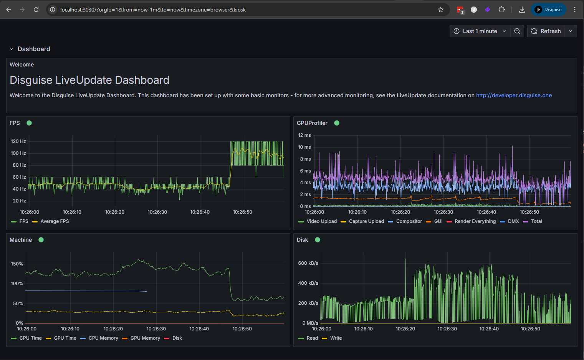

# Grafana Live Update Plugin

This plugin allows you to subscribe to the LiveUpdate WebSocket endpoint and have the data pushed to a Grafana panel in real time. This is useful for monitoring things in real time from Disguise, such as the health graphs or tracking axis. An example dashboard is supplied in the Grafana configuration.

## User Instructions (Windows)

1.  Go to the [Releases page](https://github.com/disguise-one/grafana-liveupdate/releases) of this repository.
2.  Download the `disguiseone-liveupdate-datasource-vX.X.X.zip` file from the latest release.
3.  Unzip the package.
4.  Double-click the `start-grafana.bat` file. This will start the advertiser service and the Docker containers.
5.  Open your web browser and navigate to `http://localhost:3030`.

You should see the live dashboard with the real-time data, and the plugin should be discoverable in Disguise Designer.

## Configuration

By default, the Grafana data source is configured to connect to a LiveUpdate WebSocket endpoint at `localhost`. If your Disguise server (director) is running on a different machine, you will need to update the data source configuration in Grafana.

We recommend changing the IP address from `localhost` to the IP address of your director machine.

## Developer Instructions

For developer instructions, please see [DEVELOPER.md](DEVELOPER.md).
